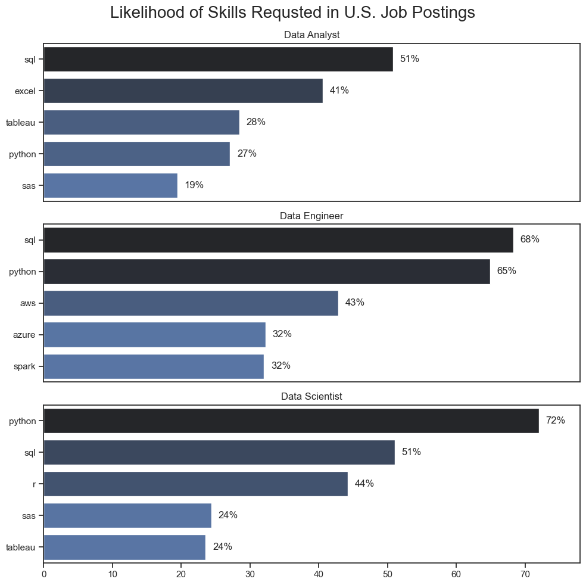

# Overview
Welcome to my analysts of this Job Market Data set, mainly focusing on Data Analyst roles. The goal of this project was to better understand and navigate the current job market. This project dives into insights like the highest payingn and most in-demand skills in order to help find the most optimal roles for Data Analysts.

The data for this project was sourced from [Luke Barousse's Python Course](https://huggingface.co/datasets/lukebarousse/data_jobs) which provides the foundation of the analysis performed. The dataset provides comprehensive information on job titles, salaries, locations, and essential skills tied to the role. Through the use of Python, I explore some key questions such as the most requested skills, salary trends, and the intersection of demand and salary in Data Analytics.

# The Questions
Below are the questions I want to anwer in my project:

1. What are the most demanded skills for the top 3 most popular data roles?
2. How are in-demand skills trending for Data Analysts?
3. How well do jobs and skills pay for Data Analysts?
4. What is the most optimal skill to learn for Data Analysts?

# Tools Used
For my dive in the Data Analyst job market, I used the power of multiple important tools:

* **Python**: The star of the analysis, allowing me to analyze the data and find critical insights. I also used the following Python Libraries.

    * **Pandas Library**: Used to analyze the data
    * **Matplotlib Library**: Used to visulize the data
    * **Seaborn Library**: Used to create more advanced and beter formatted visualizations
* **Jupyter Notebooks**: The tool I used to run my Python Scripts which let me add my notes and analysis
* **Visual Studio Code**: My primary code editor for executing Python Scripts
* **Git & GitHub**: Essential for version control and sharing my Python code and analysis

# The Analysis:
## 1. What are the most demanded skills for the top 3 most popular data roles?

To find the most demanded skill for the top 3 most popular data roles. I filtered out those positions by which ones were the most popular, and got the top 5 skills for these tiop 3 roles. This query highlights the most popular job tille and their top skills, showing which skills I should pay attention to depending on the role I am targeting.

View my notebook with detailed steps here:
[2_Skills_Count.ipynb](3_Project/2_Skills_Count.ipynb)

### Code for Visualizing Data

```python
fig, ax = plt.subplots(len(job_titles),1)
sns.set_theme(style='ticks', rc={'figure.figsize':(10,10)})

for i, job_title in enumerate(job_titles):
   df_plot = df_skills_perc[df_skills_perc['job_title_short'] == job_title].head(5)
   sns.barplot(data=df_plot, x='skill_percent', y='job_skills', ax=ax[i], hue='skill_count', palette='dark:b_r', )
   ax[i].set_title(job_title)
   ax[i].set_ylabel('')
   ax[i].set_xlabel('')
   ax[i].get_legend().remove()
   ax[i].set_xlim(0,78)

   for n, v in enumerate(df_plot['skill_percent']):
      ax[i].text(v + 1, n, f'{v:.0f}%', va='center')

   if i != len(job_titles) - 1:
      ax[i].set_xticks([])

fig.suptitle('Likelihood of Skills Requsted in U.S. Job Postings', fontsize=20)
fig.tight_layout()
plt.show()
```

### Results




### Insights

- As an analyst myself it was interesting to look at the top skills and see that 3 of top 5 are tools/software that I am proficient with as is.

- I found it interesting how important python is for the 2 more advanced roles, but stil makes its way in there for analysts. I can see that perecentage increasing as time goes on making it important to be learning python now if you don't know it already.

- The last thing I found interesting is how analysts seem to be expected to know more general skills and overall just be proficient in those. But the more advanced roles, especially engineers seem to require more specialized tools.

## 2. How are in-demand skills trending for Data Analysts?

To look at this I created a new data frame to look at just Data Analyst jobs in the United States. The plan was to make a Line Chart to plot the change over the course of the year. So, I made a new column for the Month No. Then exploded the skills column. So, that I could get the count of the mentions for each skill. Then created a totals row to sum those counts for each month up. This allowed me to sort on that Total row to find the top 5 skills. From there the Total row was deleted and I created a new index that was the short form of each month and deleted the Month No. column. This helps give the visualization a better look. Then the data was plotted.

View my notebook with detailed steps here:
[3_Skills_Trend.ipynb](3_Project/3_Skills_Trend.ipynb)

### Visualize Data

```python
df_plot = df_DA_US_percent.iloc[:, :5]

sns.lineplot(data=df_plot, dashes=False, palette="tab10")
sns.set_theme(style='ticks')
sns.despine()

plt.title('Trending Top Skills for Data Analysts in the U.S.')
plt.xlabel('2023')
plt.ylabel('Likelihood in Job Posting')
plt.legend().remove()

from matplotlib.ticker import PercentFormatter
ax=plt.gca()
ax.yaxis.set_major_formatter(PercentFormatter(decimals=0))

for i in range(5):
    plt.text(11.2, df_plot.iloc[-1, i], df_plot.columns[i])

plt.show()
```

### Results


### Insights

- Overall SQL is the most in-demand skill and did appear to have a slight decline throughout the year, but with it having a signficantly higher likelihood than the other top 5. It is safe to say SQL is here to stay and is easily the most in demand skill for Data Analysts.

- Overall the other top 5 seem to be pretty steady when looking at demand. Excel being the only one with some weird spikes either way, but based on those increase and decreases it is pretty steady.

- On key thing I did notice is that Python does seem to be on a relatively steady incline. So, something to keep and eye out for in the coming years. Python very well may be a standard thing employers are looking for in Analysts.

## 3. How well do jobs and skills pay for Data Analysts?


### Evaluate Median Salry for Top 6 Data Jobs
To gather this data for plotting I first created a dataframe that was specific to the United States and then dropped any rows where the 'salary_year_avg' column had NaN values. Then I created a list of the top 6 job titles with the most job postings from that data frame that we could then use to filter and create a top 6 data frame. From there I created a job order list that we could pass into the seaborn plot. Then I plotted the data and formatted the visualization.

View my notebook with detailed steps here:
[4_Salary_Analysis.ipynb](3_Project/4_Salary_Analysis.ipynb)

### Visualize Data

```python
sns.boxplot(data=df_US_top6, x='salary_year_avg', y="job_title_short", order=job_order)

plt.title('Salary Distributions in the United States')
plt.xlabel('Yearly Salary ($USD)')
plt.ylabel('')
plt.xlim(0, 600000)
ticks_x=plt.FuncFormatter(lambda y, pos: f'${int(y/1000)}K')
plt.gca().xaxis.set_major_formatter(ticks_x)
plt.show()
```

### Results


### Insights

- The first thing that caught my eye with this was that all the Senior roles were not at the not at the top. While it does make sense as the Engineer and Scientist roles may require more specialized skills equalling higher pay. Just something to note if you are an Analyst and thinking about becoming a Senior Analyst. Maybe you would be better off trying to be an Engineer or Scientist

- Another thing is some of the more outlying findings for the Data Scientist. There is a job posting that pays almost $600k per year and that is not a senior role. Would be interesting to see what company that is and what that roles entails.

- The final thing is some of the outliers on the lower end of the pay scale. 2 of the Senior Roles(Sr. Data Analyst & Sr. Data Engineer) have some job postings where the person being hired would be relatively underpaid compared to what plenty of other roles are hiring for.

### Investigate Median Salary vs Skill for Data Analysts

### Visualize Data
```python
fig, ax = plt.subplots(2,1)

sns.set_theme(style='ticks')
sns.barplot(data=df_DA_top_pay, x='median', y=df_DA_top_pay.index, ax=ax[0], hue='median', palette='dark:b_r', legend=False)

ax[0].set_title('Top 10 Highest Paid Skills for Data Analysts')
ax[0].set_ylabel('')
ax[0].set_xlabel('')
ax[0].xaxis.set_major_formatter(plt.FuncFormatter(lambda x, pos: f'${int(x/1000)}K'))

sns.barplot(data=df_DA_top_skills, x='median', y=df_DA_top_skills.index, ax=ax[1], hue='median', palette='light:b', legend=False)

ax[1].set_title('Top 10 Most In-Demand Skills for Data Analysts')
ax[1].set_ylabel('')
ax[1].set_xlabel('Median Salary ($USD)')
ax[1].xaxis.set_major_formatter(plt.FuncFormatter(lambda x, pos: f'${int(x/1000)}K'))
ax[1].set_xlim(ax[0].get_xlim())

fig.tight_layout()
plt.show()
```
### Results


### Insights

- A lot of the highest paying skills has to deal with software technologies and are highly specialized. They are by no means highly requested, but for the jobs that do request them. They pay well.

- The more in-demand skills are much more common across the board and it can be seen that the more advanced software and tools will pay you more.

- A common theme with this analysis is that Python is at the top. Being a more advanced skill it pays more, but as we saw from trends earlier in the analysis the requested rate of python is increasing. So, it would be a great skill to begin learning for anyone that has no Python experience.

## 4. What is the most optimal skill to learn for Data Analysts?

To gather the data for this visualization I needed to make a new data frame that looked at Data Analyst roles in the U.S. Then explode the skill column so that we could get the count and median for salary by job skill. Then did the work to create a skill percent column. This would then allow me to create a filter for hihghest demand skills to give me a new data frame. Then it was time to plot and format the chart.

View my notebook with detailed steps here:
[5_Optimaal_Skills.ipynb](3_Project/5_Optimal_Skills.ipynb)

### Results


### Insights
- It is important to note that the highest paying and most commonly requested skills are Python, SQL, and Tableau. So, knowing some more advanced software tools does pay and gives aspiring and current Data Analysts the best chance at finding new roles and with higher pay

- The Microsoft tools such as: PowerPoint, Word, and Excel seme to pay lower. Excel is much more mentiond than the other 2 however and does seem like it would still be a good skill to have even if it may not pay as much as some more advanced tools

# What I learned

Throughout this project I heightend my understanfin of the Data Analyst job market while honing my current Python understanding and developiing new technical skills in Python. Especially, the ability to manipulate and visualize data. Here are some specifics to what I learned:

* **Advanced Python Skills**: With the libraries offered in Python like Pandas for data manipulation and Seaborn & Matplotlib for visualization I was able to perform more complex data analysis tasks more efficiently

* **Strategic Skills Analysis**: The whole point of the project was to better understand and align myself with the skills being requested in a Data Analyst role. The understanding this project bring between skill demand, salary, and job availability allows for a more strategized approach for carrer planning.

* **Data Cleaning Importance**: This project brought a better understanding to the importance of having properly cleaned and prepared data. This ensuring the accuracy of insights derived from the data.

# Project Insihgts
This project provided several general insights into the job market for analysts:

* **Skill Demand & Salary Correlation**: There is a clear correlation between the demand of certain skill and the salary for the role. More advanced and specialized skills such as Python, Tableau, SQL, Oracle lead to higher salaries.
* **Market Trends**: There are some changing trends in terms of skills demand. Some skills are steady and do not appear to be going anywhere, some are on the decline, and some like Python are becoming more and more prevalent for Analysts.
* **Economic Value of Skills**: By understanding which skills are in-demand and highly compensated Data Analysts can better prioritizing the learning of skills to maximize economic return.

# Challenges I Faced

Throughout this project plenty of challenges were faced, but where challenges are is also the opportunity to overcome them:

* **Data Inconsistencies**: Handling missing or inconsistent data entries requires careful consideration and thorough data cleaning techniques in order to ensure the integrity of the data analysis
* **Complex Data Visualization**: Designing effective visual representations comes at no easy feat. Constantly tring to convey the insights in a clear yet compelling manner.
* **Balancing Breadth and Depth**: When doing analysis you have to determine how deep you want to dive in while still maintaining a broad overview of what data we are looking at and without gettting to far away from the questions we are trying to answer.

# Conclusion
This exploration into the Data Analyst job market has been incredibly insightful. Not only have I gained a better understanding of Python tools and improved my skills, but can take this information about the critical skills and trends that shape this field. These insights will not only be good for me as I delve deeper into this field, but for plenty of others as well.